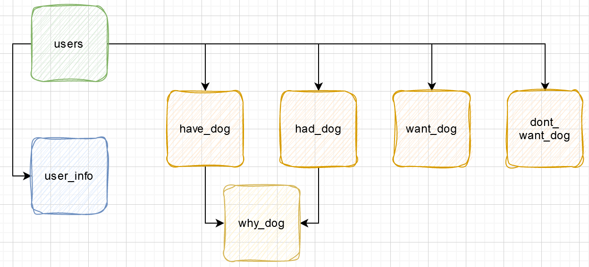
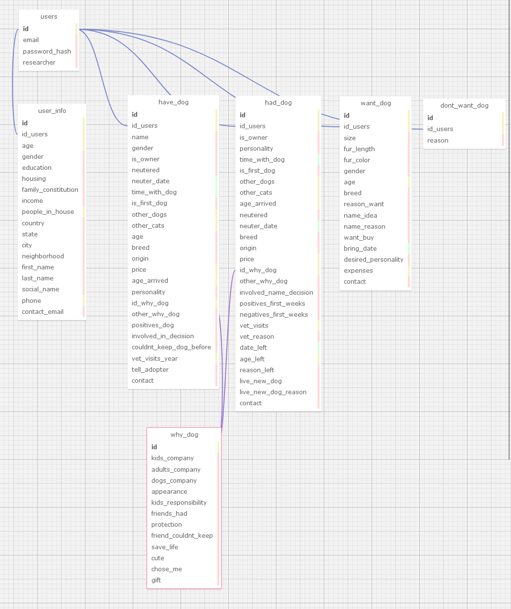

## Documentação Simplificada do Modelo Relacional

**Projeto:** Abandono Zero - PsicoPets

**Data:** 2024-05-9

**Autor:** Gustavo Colombini

**Objetivo:** Descrever o modelo relacional do projeto de forma resumida e simplificada.

## Entidades

- **Usuários** (`users`): Armazena informações básicas sobre os usuários (nome, email, etc.).
- **Formulários**
  - **Resenha** (`user_info`): Detalhes gerais do usuário (renda, moradia, etc.) + Dados para contato futuro com o usuário (nome completo, celular, email).
  - **Possui Cão** (`have_dog`): Informações sobre o cão que o usuário possui (raça, idade, etc.).
  - **Já Teve Cão** (`had_dog`): Informações sobre o cão que o usuário já teve (nome, personalidade, etc.).
  - **Motivo Cão** (`why_dog`): Tabela especificamente para pergunta sobre motivos de ter o cão (múltipla escolha e pode escolher mais de uma).
  - **Deseja Cão** (`want_dog`): Informações sobre o cão que o usuário deseja ter (tamanho, pelagem, etc.).
  - **Sem Cão** (`dont_want_dog`): Motivo pelo qual o usuário não tem e não deseja ter um cão.

## Relacionamentos

- Um usuário pode ter um único formulário de resenha, um único formulário dependendo de qual ele se qualificar (1:1), ou seja, todos os formulários possuem uma *chave estrangeira* que está ligada ao **id** do usuário, a *chave primária*.
- Se o usuário preencher o formulário de "possui cão" ou "já teve cão", o formulário possui uma *chave estrangeira* está ligada para um único formulário de "motivo cão" (1:1).

## Regras de Negócio

- Todos os campos obrigatórios devem ser preenchidos. (Apenas para o usuário, dependendo das respostas alguns dados poderão ser nulos na base de dados).
- As informações devem ser consistentes entre os formulários.
- Os usuários não podem editar informações já salvas, exceto em casos específicos.
- As informações dos usuários são confidenciais.

## Diagrama Simplificado

## Considerações Finais

Este modelo relacional fornece uma base para o gerenciamento eficiente das informações dos usuários e suas respostas nos formulários do projeto Abandono Zero. Sua estrutura já considera o registro e armazenamento de cada uma das respostas na base de dados, permitindo que ele sejá utilizado para gerar de fato a estrutura da base de dados em PostgreSQL. As entidades, seus atributos e relacionamentos garantem a organização e a integridade dos dados. As regras de negócio garantem a consistência e a confiabilidade das informações.

**Observações:**

- Este modelo é uma versão simplificada e pode ser adaptado às necessidades específicas do projeto.
- É importante documentar detalhadamente o modelo relacional para facilitar o entendimento e a manutenção do sistema.
- A implementação do modelo relacional deve seguir boas práticas de desenvolvimento de banco de dados.

## Diagrama

